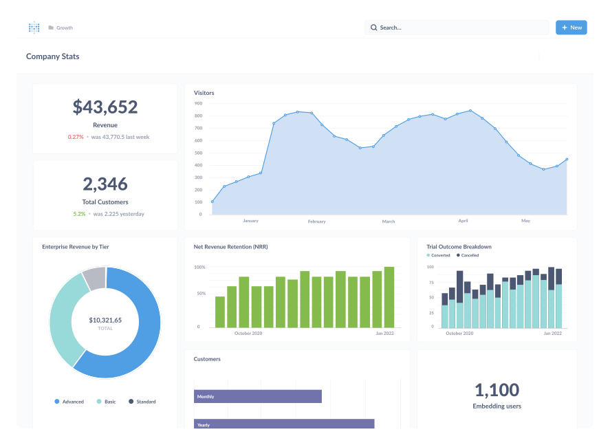
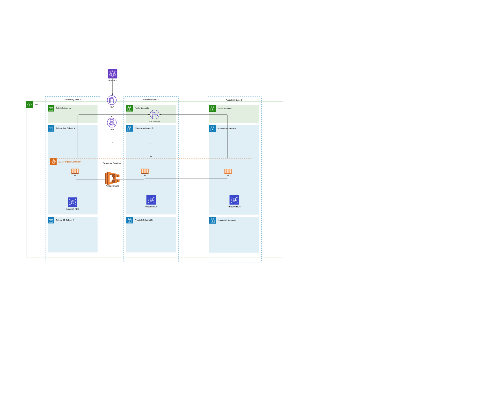

# Metabase Implementation

### What is Metabase?
Metabase is a completely open source BI tool, this platform offers graphs, dashboards and other organizations using question-based data manipulation

### Get Start
The project was implemented in a containerized manner in the AWS cloud.
Using the Ohio region, the application is located in 3 different AZ's to guarantee high availability of the environment, so that container management is objective and efficient, we use ECS (Elastic Container Service) as an orchestrator.

### Architecture

### AWS ECS Fargate
O serviço do ECS está implementado como Fargate eliminando quaisquer gestão de instancias e seus SO (Sistema Operacional), o serviço possui seu próprio grupo de segurança bem como sua role permitindo o acesso aos demais serviços da AWS. Para garantir escalabilidade, foi implementado um serviço de Application LoadBalancer que recebe o tréfego na porta 443 (HTTPS) e encaminhando para o(s) container(s) de forma balanceada

### Database with RDS
For reasons of best practices, security and infrastructure isolation, the database was structured separately from the application, we used the RDS managed service for the bank, this service has backup management, infrastructure management as well as shared security management with to AWS.

### LOGS
O serviço possui a saída de logs integrada com o cloudwatch logs, foi escolhido este serviço devido ao seu menor gerenciamento por ser totalmente serverless

### Implementation Method
The environment was built in IaC using terraform as a coding tool, the creation of each Resource was based on modules, we chose this method as it allows the versioning of the infrastructure as well as the standardization of code writing. To configure the module call, we used terraform workspace, as this method allows the same written, tested and properly validated code to be used for other environments (Approval and Production).
The writing of the modules was based on git flow, where we have the main (production) and dev (development) branches for each new increment, we make a commit, for each set of commits we will have a feature.
The implementation of the code under development for production takes place through PR (Pull Request) with appropriate tagging marking the versions to be used.

## Links dos Módulos

### Application LoadBalancer 
https://github.com/felipelima5/metabase-project-alb-module

### ECS Cluster
https://github.com/felipelima5/metabase-project-ecs-cluster-module

### Application ECS
https://github.com/felipelima5/metabase-project-ecs-app-module

### RDS Database
https://github.com/felipelima5/metabase-project-rds-module

